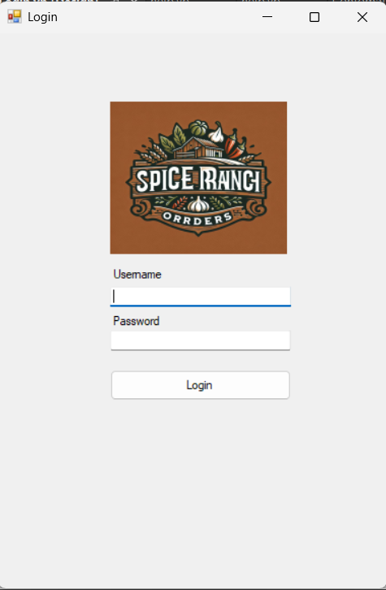
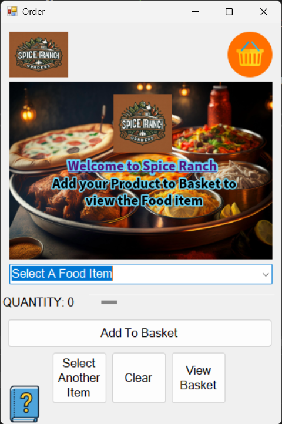
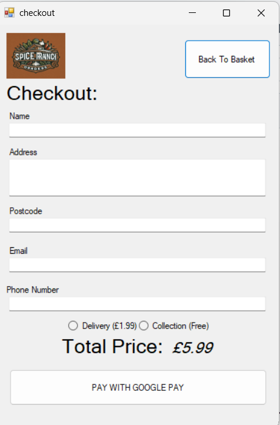
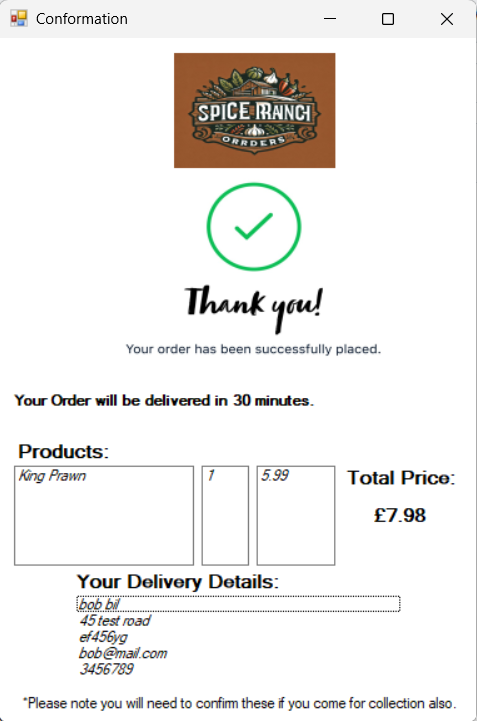

<h1>🥘 Spice Ranch Ordering System</h1>

A desktop ordering application developed as a <strong>college project</strong> to replace a traditional paper-based ordering system with a digital solution. The system simulates a real fast-food ordering workflow, from login through to order confirmation.

<h2>🧾 About</h2>

The <strong>Spice Ranch Ordering System</strong> was built to digitise the ordering process for a takeaway restaurant. Instead of staff writing orders on paper, this system allows users to place orders through a clear, multi-page interface.

The application follows a realistic order journey, including authentication, menu selection, basket review, checkout, and confirmation.

<h2>🖥️ Application Pages</h2>
<ul>
    <li><strong>Login Page</strong> – Allows users to access the system before placing an order.</li>
    <li><strong>Order / Menu Page</strong> – Displays available food items and allows users to select items to add to their order.</li>
    <li><strong>Basket Page</strong> – Shows all selected items, quantities, and the current total price.</li>
    <li><strong>Checkout Page</strong> – Final review of the order before confirming.</li>
    <li><strong>Confirmation Page</strong> – Displays order confirmation once checkout is completed.</li>
    <li><strong>Help Page</strong> – Provides guidance on how to use the system.</li>
</ul>

<h2>✨ Features</h2>
<ul>
    <li>Multi-page user interface (Login → Order → Basket → Checkout → Confirmation)</li>
    <li>Dynamic basket with shared order data</li>
    <li>Centralised data handling using shared variables</li>
    <li>Simple and intuitive navigation</li>
    <li>Designed to replace paper-based ordering</li>
</ul>

<h2>📸 Screenshots</h2>

   <h3>🔐 Login Page</h3>
   

   <h3>🍔 Order / Menu Page</h3>
   

   <h3>🧺 Basket Page</h3>
   

   <h3>💳 Checkout Page</h3>
    

   <h3>✅ Order Confirmation Page</h3>
    

   <h3>❓ Help Page</h3>
   

<h2>🧠 Program Structure</h2>

<strong>Globals.vb</strong> is used to store shared data that needs to be accessed across multiple forms. This includes:

<ul>
    <li>Arrays for selected menu items</li>
    <li>Quantities</li>
    <li>Prices</li>
    <li>Running totals</li>
</ul>

Using <strong>Globals.vb</strong> allows:

<ul>
    <li>Data to persist between pages</li>
    <li>Cleaner form-to-form communication</li>
    <li>Avoiding duplication of logic</li>
</ul>

<h2>🛠️ Technologies Used</h2>
<ul>
    <li>Visual Basic .NET</li>
    <li>Windows Forms</li>
    <li>Microsoft Visual Studio</li>
    <li>Event-driven programming principles</li>
</ul>

<h2>🚀 Getting Started</h2>

These instructions will help you run the project locally.

<h3>Prerequisites</h3>
<ul>
    <li>Microsoft Visual Studio</li>
    <li>.NET Framework compatible with the project</li>
</ul>

<h2>📥 Installation</h2>
<ol>
    <li>Clone the repository:
        <pre><code>git clone https://github.com/hasanbodhania/Spice-Ranch-Ordering-Sytem-College-Project-.git</code></pre>
    </li>
    <li>Open the solution file:
        <pre><code>Spice Ranch Ordering System.sln</code></pre>
    </li>
    <li>Build the solution: <em>Build → Build Solution</em></li>
    <li>Run the application: Press <strong>F5</strong></li>
</ol>

<h2>▶️ Usage</h2>
<ol>
    <li>Launch the application</li>
    <li>Log in to access the system</li>
    <li>Select items from the menu</li>
    <li>Review selections in the basket</li>
    <li>Proceed to checkout</li>
    <li>View order confirmation</li>
</ol>

<h2>Author</h2>

<strong>Hasan Bodhania</strong> 
Email: hasanbodhania@gmail.com 
Phone: 07878 253584

